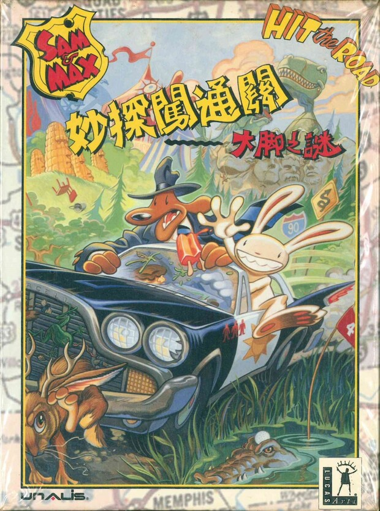
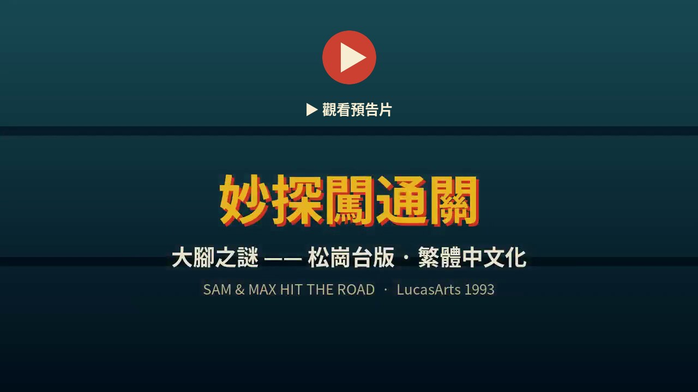
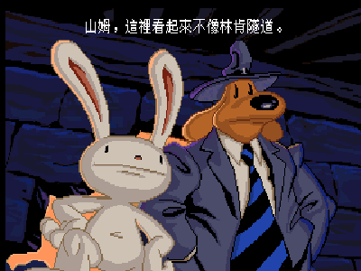
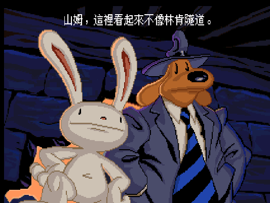
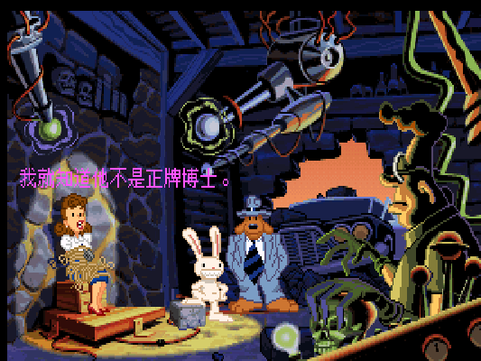
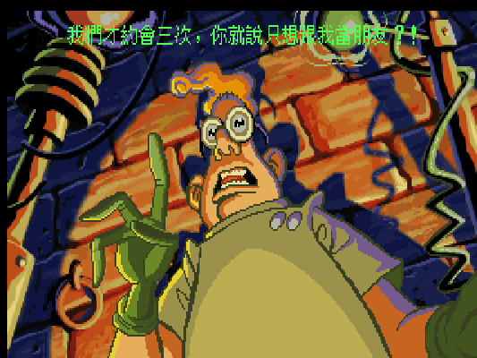
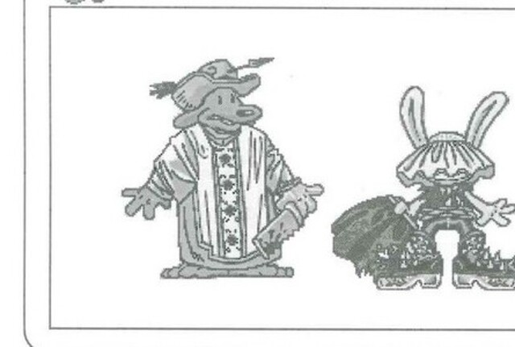
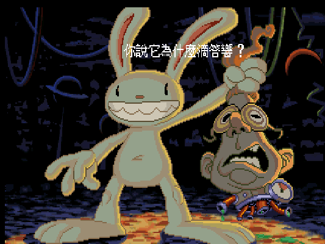
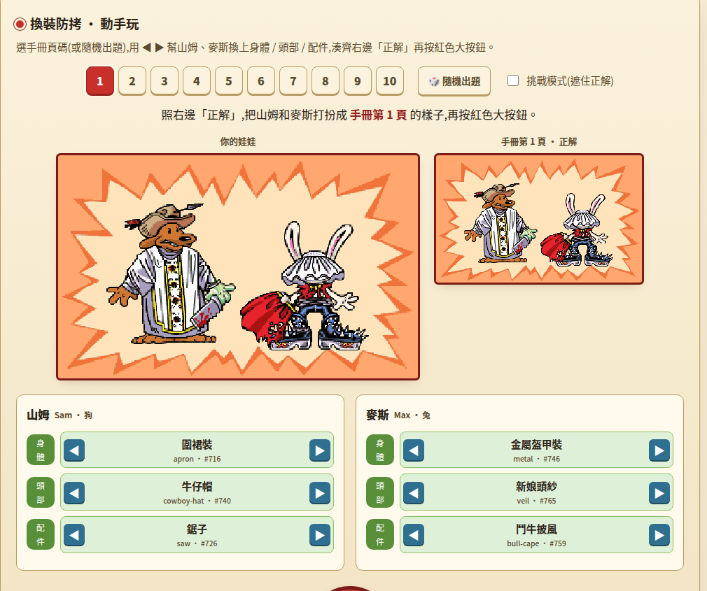
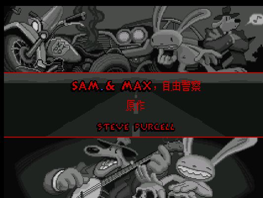

<p align="center">
  
</p>

<h1 align="center">妙探闖通關——大腳之謎</h1>
<p align="center"><em>Sam &amp; Max Hit the Road · 繁體中文化</em></p>
<p align="center">一隻西裝狗、一隻沒下限的兔子，開著偷來的警車橫越美國找雪怪——<br>三十年後，讓它第一次用繁體中文開口說話。</p>

<p align="center">
  <a href="https://youtu.be/ITJVSq5koXM">
    
  </a>
</p>
<p align="center"><sub>▶ <a href="https://youtu.be/ITJVSq5koXM">觀看繁體中文版預告片（YouTube）</a></sub></p>

<p align="center">
  
</p>
<p align="center"><sub>實機中文遊玩：對白、選項、物品欄全繁體，真機驗證無撞碼。</sub></p>

---

那是一個開機要先翻說明書的年代。

你把厚厚一本手冊攤在鍵盤旁，螢幕上山姆和麥斯正手忙腳亂地翻衣櫃，遊戲要你「照手冊第某頁把他們打扮好」——穿錯了，牠們就把你踢出去。你一頁頁翻找那些小小的換裝素描，對照著把巫師袍、奇裝異服一件件套上去，按下螢幕正中那顆紅色大按鈕，畫面才緩緩化開，公路、警笛、兩張欠揍的臉，一場橫越全美的荒謬冒險就此上路。

那本手冊，我後來弄丟了。多數人也都弄丟了。

這個 repo 想做的，是把當年那份體驗連同它的荒謬一起接回來——只是這一次，山姆和麥斯講的是中文。

---

## 目錄

- [🎪 這是一部什麼樣的遊戲](#-這是一部什麼樣的遊戲)
- [🚗 松崗與那個沒有中文版的年代](#-松崗與那個沒有中文版的年代)
- [👕 紅色大按鈕與換裝防拷](#-紅色大按鈕與換裝防拷)
- [📖 譯名考古](#-譯名考古)
- [🔧 技術深潛](#-技術深潛)
- [🎎 線上防拷紙娃娃](#-線上防拷紙娃娃)
- [📦 這個 repo 裡有什麼](#-這個-repo-裡有什麼)
- [🎮 怎麼玩](#-怎麼玩)
- [🙏 致謝與版權](#-致謝與版權)

---

## 🎪 這是一部什麼樣的遊戲

先說結論給沒玩過的新朋友：這是 1993 年 LucasArts 冒險遊戲黃金期的代表作之一，也是老玩家心裡「幽默感天花板」那一檔。

故事很單純，胡鬧得很認真。馬戲團的招牌明星——大雪怪「大腳」布魯諾，連同「長頸女孩」翠西一起失蹤了。世界頂尖（自封）的偵探搭檔山姆與麥斯接到警察局長一通電話，就一路尖叫著把車開進高速公路的車陣，展開一場橫越全美、越查越離譜的追人之旅。世界最大的麻線球、鱷魚高爾夫球場、恐龍瀝青坑、名人蔬菜博物館……每一站都荒唐，每一句對白都想讓你笑出聲。

<p align="center">
  
</p>
<p align="center"><sub>「山姆，這裡看起來不像林肯隧道。」——麥斯的方向感一向如此可靠。</sub></p>

主角山姆是隻穿西裝戴軟帽、講話慢條斯理的狗偵探；麥斯是他那位近乎失控、動不動就想咬人的兔子搭檔，兩隻合稱「自由警察」（Freelance Police）。這對搭檔不是遊戲原創——牠們出自漫畫家 Steve Purcell 之手，1987 年就在地下漫畫《Sam &amp; Max: Freelance Police》裡登場（32 頁，Fishwrap Productions 出版），是先有 cult 漫畫、再被 LucasArts 相中做成遊戲的。[¹](#資料來源) 這是 LucasArts 第九款使用 SCUMM 引擎的作品，音樂用上了 Michael Land 與 Peter McConnell 開發的 **iMUSE 互動配樂系統**，讓爵士配樂能跟著場景與玩家動作無縫轉換。[²](#資料來源)

<p align="center">
  
</p>
<p align="center"><sub>那台永遠開不壞的 DeSoto，是全美荒謬景點之間唯一的定點。</sub></p>

當年它拿下的評價相當硬：《Computer Game Review》給了 94 分與 Golden Triad Award，並選它為「1993 年最佳冒險遊戲」；EDGE 給 9/10，稱讚它「令人捧腹」的對白。[³](#資料來源) 這對搭檔後來也一路活了下來——1997 年 Fox 播過改編動畫（Nelvana 製作，24 集），2006 年 Telltale Games 拿到授權，用《Sam &amp; Max Save the World》開創了公認第一個成功的「分章節（episodic）遊戲」模式。[⁴](#資料來源) 你手上這款 1993 年的原點，就是這一切的起頭。

遊戲玩法沿用 LucasArts 招牌的點按式冒險：右鍵切換動作圖示、左鍵執行，撿東西、看東西、跟人聊天、把奇怪的道具用在更奇怪的地方。手冊還很體貼地叮嚀新手——卡關別放棄，先去別處解謎、找新物品，或者乾脆去玩一段小遊戲換換腦袋。是的，它內建了好幾個免費小遊戲：遊樂團裡的**打老鼠**、地圖西南角的**高速公路大狂飆**（右鍵換車道、左鍵讓麥斯跳過招牌）、Snuckey's 貨架上的**汽車炸彈**與**麥斯的畫冊**塗色遊戲。按 `Q` 隨時跳出。完整操作與小遊戲玩法，整理在 [`docs/manual.md`](docs/manual.md)。

---

## 🚗 松崗與那個沒有中文版的年代

聊點在地的。

當年這片在台灣是**松崗**代理的，台版正式名稱就是我們熟悉的《妙探闖通關——大腳之謎》，遊戲編號 917302，建議售價 NT$560，發行商是松崗電腦圖書資料股份有限公司（英文名 Unalis）。松崗成立於 1976 年，是 1990 年代台灣 PC 遊戲代理與翻譯的老字號之一。[⁵](#資料來源) 那個年代的「中文版」，多半是中文**包裝與手冊**，遊戲畫面裡跑的仍是英文——螢幕上英文、手邊一本中文說明書，是一整代玩家的共同記憶。

<p align="center">
  
</p>
<p align="center"><sub>「我們才約會三次，你就說只想跟我當朋友?!」——這種一句入魂的台詞，正是它最捨不得只讓你看英文的地方。</sub></p>

問題就在這裡。《大腳之謎》最迷人的東西，恰恰是它塞滿雙關、諧音、冷吐槽的**對白**——而這正是當年中文包裝碰不到的那一層。松崗手冊把故事、操作、譯名都做得很用心，但遊戲一開口還是英文；那些讓人笑到拍桌的句子，隔著語言的玻璃看得到、摸不著。這款「經典卻沒有中文版」的遺憾，一擱就是三十年。

這個專案補的就是那層玻璃。全文本 **6,016 行**已經翻完，並做過第二輪校對（約 440 處修正）；譯名一律以松崗台版手冊為第一優先，手冊查不到的再往當年攻略、現代通行譯名依序退。翻譯盡量守住原作那股插科打諢的瘋趣，也守住 1993 年的年代感，不硬塞當代流行語。

---

## 👕 紅色大按鈕與換裝防拷

還記得開頭那段翻手冊的回憶嗎？該講講它的來龍去脈了。

當年沒有 Steam、沒有序號，防拷靠的是「你手上有沒有正版手冊」。《大腳之謎》的做法特別可愛：一進遊戲，山姆和麥斯在衣櫃前手忙腳亂，畫面要你**翻到手冊第 N 頁**，照那頁頁尾的換裝素描，把牠倆打扮成一模一樣——巫師袍、盔甲、奇裝異服，一件件選對，再按下螢幕正中那顆**紅色大按鈕**。穿對了才放你進遊戲；穿錯，還有第二次機會，再錯就「bye-bye!」直接關掉。

<p align="center">
  
</p>
<p align="center"><sub>松崗手冊內頁頁尾的換裝素描——山姆的巫師袍、麥斯的奇裝，正是當年的「通關密語」。</sub></p>

麻煩的是：手冊掉了，你就進不去。這款遊戲的防拷（版本字串 `CD1.11, 3-24-94`）沒被 ScummVM 內建的略過清單涵蓋，所以就算用模擬器，這關還是躲不掉。

我們的處理方式，是把這道關卡連同它的懷舊感一起「還原」出來，而不是繞過去。10 頁、山姆與麥斯各 10 組換裝答案，全部從遊戲腳本反組譯還原（見下一節與 [`docs/copy-protection-answers.md`](docs/copy-protection-answers.md)），再做成一頁互動網頁——手冊掉了，開網頁照著穿就行。這也是這個專案想守的一條線：老東西的價值不只在能不能過關，也在那份「翻手冊、對圖、按下大按鈕」的儀式感。

---

## 📖 譯名考古

譯名這件事，這個專案的態度是**還原時代條件**，不是拿今天的眼光去糾正當年。

松崗手冊怎麼寫，就儘量怎麼沿用——即使有些用字帶著 1990 年代的味道，那味道本身就是文物的一部分。手冊沒有收錄的角色與地名（遊戲比手冊龐大太多），才往當年的攻略、再往現代通行譯名依序補齊，並在譯名表裡逐條標明來源。下面是最核心的幾個：

| 原文 | 本專案譯名 | 來源 |
|---|---|---|
| Sam &amp; Max Hit the Road | 妙探闖通關——大腳之謎 | 松崗盒面／手冊封面 |
| Sam | 山姆（狗偵探） | 松崗手冊頁 1 |
| Max | 麥斯（兔子搭檔） | 松崗手冊頁 1 |
| Bruno the Bigfoot | 「大腳」布魯諾 | 松崗手冊頁 1 |
| Trixie the Giraffe-Necked Girl | 「長頸女孩」翠西 | 松崗手冊頁 1 |
| The Commissioner | 警察局長 | 松崗手冊頁 1 |
| Freelance Police | 自由警察 | 本專案（手冊無正式譯名） |

松崗手冊只涵蓋主要角色與少數地名；遊戲裡上百個荒唐專有名詞——鱷魚高爾夫、名人蔬菜博物館、康羅伊頭型茄子——多半得自己譯，還要保住原作的笑點。這些取捨與來源標記，全數落在 [`docs/glossary.md`](docs/glossary.md)。一句話：**手冊為先，考古為據，笑點不丟**。

---

## 🔧 技術深潛

以下切換到工程視角，說明這份中文化在引擎層面實際做了什麼。核心原則：能不改引擎就不改，把中文塞進引擎「本來就走得通」的路徑。

<p align="center">
  
</p>
<p align="center"><sub>「你說它為什麼滴答響？」——每一個中文字，都經過下面這條管線烘出來。</sub></p>

### 1. 引擎：一行白名單 patch

`samnmax`（SCUMM v6）不在 ScummVM 的 ZH_CHN 中文渲染白名單內，經源碼查證（`engines/scumm/charset.cpp` 的 `loadCJKFont()`，master 與 2.8 分支一致）確認零 patch 路線不成立。唯一的引擎更動，是在白名單加入 `GID_SAMNMAX`：

```diff
- if (_vm->_game.id == GID_MONKEY || ... )
+ if (_vm->_game.id == GID_MONKEY || ... || _vm->_game.id == GID_SAMNMAX)
```

其餘完全沿用引擎既有的 CJK 字型偵測路徑（基準 v2.8.0，見 [`patches/`](patches/)）。patch 檔本身、不送 upstream。

### 2. 碼空間：寄生在 GB2312 合法區間

採自訂雙位元組編碼，讓每個位元組都落在 `0xA1–0xFD`（GB2312 合法範圍）。如此 lead 與 trail 皆 ≥ 0xA1，既不撞 SCUMM／scummtr 的 ASCII 特殊字元（`@`=0x40 padding、`\`=0x5C escape、`0xFE/0xFF` 控制碼），又滿足引擎「雙位元組字 trail ≥ 0x80」的假設——引擎與 scummtr 一行都不用改。**不能用 GBK**：其 trail 可落在 `0x40–0x7E`，會撞上述位元組，造成字元級亂碼與回填錯誤，是這條路上最貴的雷。索引照 GB2312 公式 `idx=(lead-0xA1)*94+(trail-0xA1)`。

### 3. latin-1 撞碼修復

一個踩過的坑：SCUMM 的 CJK 模式下，任何 `byte ≥ 0x80` 都被當成雙位元組的前導位元組。譯文裡人名的間隔號「·」、`Flambé` 的 é 這類**單位元組拉丁字元**正好落在此範圍，會觸發撞碼連鎖錯位。修法是把這 114 行用到的高位拉丁字元也收進碼表，當合法字處理。

### 4. 字型：16×16 是死路，關鍵在烘字法

一開始嫌 12×12 繁體字「彆扭」，想學 PC98／FM-Towns 走 16×16 高解析。第一性坐實這是死路：ScummVM 的 16×16 中文需要 `_textSurfaceMultiplier=2` 的底圖放大管線，而那條管線只綁 FM-Towns／Mac 版；DOS 版的 samnmax 沒有 → 底圖 pitch 錯位，畫面變「雪花」。

真正讓字彆扭的不是尺寸，是烘字法。原本用 PIL 對向量字二值化，12px 下筆劃細如噪點；改用 **WenQuanYi Zen Hei Sharp 的 embedded bitmap**（設計師手繪點陣）重烘，字就清晰了。字型檔規格：`chinese_gb16x12.fnt`、12×12、1bpp MSB-first、每 glyph 24 bytes、`numChar=8178`，放進遊戲夾即自動觸發中文渲染。

### 5. 文字：scummtr round-trip

`scummtr`（dwatteau，MIT）匯出 → 翻譯 → 編碼 → 回填，全程 byte 級可逆。回填前先做「原封不動回填 → diff=0」的 round-trip 驗證可逆，再動文字；引擎行為一律以 descumm 反組譯與 headless 實機截圖為 oracle，不憑記憶斷言。

### 6. 防拷：反組譯還原成線上紙娃娃

`descumm` 反組譯 room 71 的判定腳本（Script #202–204）後可知：答案表 `array304` 是一段 60 字元的 XOR 資料，每頁 6 字元（前 3 個 Sam、後 3 個 Max），對應物件編號 `(字元 − 65) + 基址`（Sam 基址 715、Max 745）。順著這條式子把 10 頁答案全部解出，再對照手冊掃描插圖驗證無誤，就成了下一節那頁互動網頁的資料來源。

完整工程規格見 [`docs/engineering-spec.md`](docs/engineering-spec.md)。

---

## 🎎 線上防拷紙娃娃

<p align="center">
  
</p>
<p align="center"><sub>10 頁換裝答案，反組譯還原成一頁互動網頁——手冊掉了也能過關。</sub></p>

**線上懷舊：<https://wicanr2.github.io/sam_and_max_hit_the_road/>**

**預告片：[▶ 在 YouTube 觀看繁體中文版預告片](https://youtu.be/ITJVSq5koXM)**

遊戲叫你翻到第 N 頁，你就在這頁選第 N 頁；山姆與麥斯該穿的服裝、配件、頭飾會標出來，照著在遊戲裡穿好、按紅色大按鈕即可。全部用原創手繪 SVG，資料出自上一節的反組譯還原（[`docs/copy-protection-answers.md`](docs/copy-protection-answers.md)）。

> 部署提醒：需在 repo Settings → Pages 指定由 `docs/` 發佈後生效。

---

## 📦 這個 repo 裡有什麼

這是一個 **patch-only** 專案：只含中文化資料與工具，**不含遊戲本體**。

| 目錄 | 內容 |
|---|---|
| `patches/` | ScummVM 一行白名單 patch（`charset.cpp` 的 ZH_CHN 白名單加 `GID_SAMNMAX`，基準 v2.8.0） |
| `tools/` | 中文化工具鏈：碼表蒐集、編解碼、字型烘焙、回填修補、譯文校驗（繁體中文註解） |
| `font/` | `cht_table.json`（自訂碼空間碼表）＋ `chinese_gb12emb.fnt`（出貨字型） |
| `translation/` | 繁體中文譯文（scummtr 匯出格式，TAG 對位） |
| `docs/` | 工程規格、譯名表、松崗手冊整理、防拷答案表、線上防拷網頁 |

遊戲本體、CD 語音、MT-32 ROM 等版權物一律不入公開 repo。含遊戲的**三平台完整版**（Windows／macOS／Linux）均已打包驗證，只在本機保留、不對外散布——Linux 為 AppImage、Windows 為 MinGW 跨編可攜版、macOS 為 GitHub Actions 自編的 universal（arm64＋x86_64）`.app`（workflow 見 [`.github/workflows/`](.github/workflows/)）。公開這裡的，永遠只有 patch、工具、資料與文件。

---

## 🎮 怎麼玩

你需要自備一份 CD 版遊戲檔。步驟如下：

1. 準備 Sam &amp; Max Hit the Road CD 版：`SAMNMAX.000`／`SAMNMAX.001` ＋ 語音 `MONSTER.SOU`。
2. 套用 [`patches/`](patches/) 的白名單 patch 自行編譯 ScummVM v2.8.0（或使用已內建 patch 的 build）。
3. 把中文資料檔與 `font/chinese_gb12emb.fnt`（更名為引擎預期的 `chinese_gb16x12.fnt`）放進遊戲目錄。
4. 在 ScummVM 加入遊戲、語言設為中文、開字幕即可開玩。

<p align="center">
  
</p>
<p align="center"><sub>中文標題畫面。準備好翻手冊、按紅色大按鈕了嗎？</sub></p>

> CD 版為 talkie 版本：保留英文語音，搭配中文字幕。本機完整版打包（含字型、MT-32 音色 launcher）不放進 repo（含語音與 ROM 等版權物，僅供個人本機使用）。

---

## 🙏 致謝與版權

- 松崗電腦（Unalis Corporation）《妙探闖通關——大腳之謎》台版手冊——譯名第一優先來源
- 骨灰集散地掃描計畫的手冊掃描（2016-08-21，25 張）
- 青衫（邱冀）攻略站的本作資料
- [scummtr](https://github.com/dwatteau/scummtr)（dwatteau，MIT）、[ScummVM](https://www.scummvm.org/)
- [WenQuanYi 文泉驛字型](http://wenq.org/)（字型，GPL/Apache 授權）

LucasArts、Steve Purcell 與 Sam &amp; Max 相關權利屬原權利人所有。本專案為**非營利愛好者中文化**，僅散布 patch 與工具，不含任何遊戲本體或版權素材。

<a id="資料來源"></a>

### 資料來源

1. [Sam &amp; Max — Wikipedia](https://en.wikipedia.org/wiki/Sam_%26_Max)（角色起源、1987 年 Fishwrap Productions 漫畫）
2. [Sam &amp; Max Hit the Road — Wikipedia](https://en.wikipedia.org/wiki/Sam_%26_Max_Hit_the_Road)（SCUMM 第九款、iMUSE 由 Michael Land 與 Peter McConnell 開發、CD 版含語音與配樂）
3. [LucasArts Wiki — 評價與獎項](https://lucasarts.fandom.com/wiki/Sam_%26_Max_Hit_the_Road)（Computer Game Review 94 分 Golden Triad、1993 最佳冒險遊戲、EDGE 9/10）
4. [Sam &amp; Max Save the World — Wikipedia](https://en.wikipedia.org/wiki/Sam_%26_Max_Save_the_World)（1997 Fox／Nelvana 動畫、2006 Telltale episodic 復活）
5. [松崗科技 — 維基百科](https://zh.wikipedia.org/wiki/%E6%9D%BE%E5%B4%97%E7%A7%91%E6%8A%80)（1976 年成立，台灣 PC 遊戲代理與翻譯老字號）
